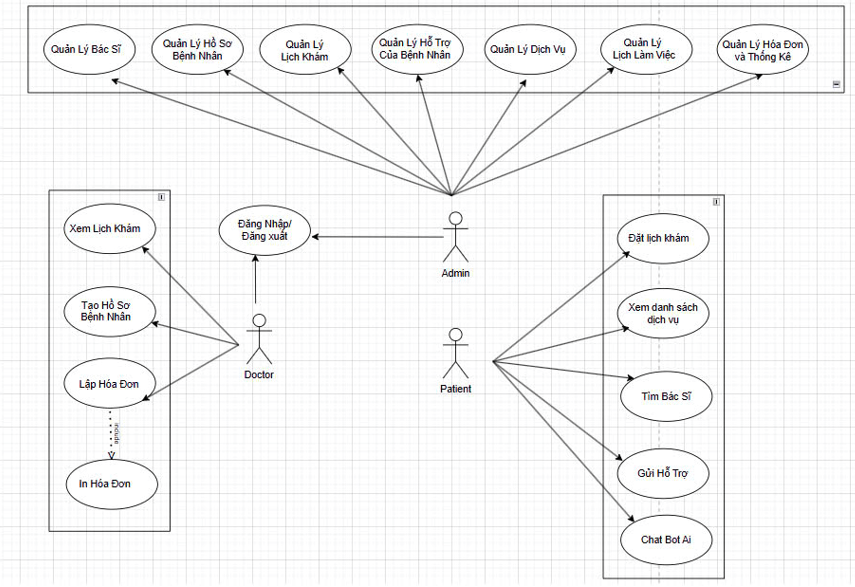

## 1. Bản vẽ kiến trúc hệ thống

*Miêu tả một chút về use case…*

## 2. Mô tả chi tiết các thành phần

- **Giao diện người dùng (UI)**:  
  Dựa trên Blade Template của Laravel, được phân quyền theo vai trò người dùng như Admin, Bác sĩ, Nhân viên và Bệnh nhân.

- **Web Server (Laravel)**:  
  Là backend chính, chịu trách nhiệm xử lý logic nghiệp vụ, định tuyến (routing), xác thực, gửi email và xử lý biểu mẫu.

- **RESTful API Layer**:  
  Được định nghĩa trong `routes/web.php`, hỗ trợ giao tiếp giữa hệ thống frontend và các ứng dụng bên ngoài.

- **Cơ sở dữ liệu CockroachDB**:  
  Là hệ quản trị cơ sở dữ liệu phân tán tương thích PostgreSQL. Dữ liệu được lưu trữ với khả năng mở rộng theo chiều ngang, hỗ trợ replication và sharding tự động giữa các node.

- **Sharding/Replication**:  
  CockroachDB thực hiện sharding tự động dựa trên khoảng dữ liệu (range) và áp dụng thuật toán đồng thuận Raft để đảm bảo tính nhất quán và khả năng khôi phục khi có sự cố.

- **Giao thức giao tiếp**:  
  Sử dụng HTTP/HTTPS cho giao tiếp client-server và giao thức SQL cho tương tác giữa Laravel và CockroachDB.

- **File Storage**:  
  Sử dụng lưu trữ cục bộ (local) thông qua Laravel filesystem. Có thể mở rộng lên các dịch vụ đám mây như Amazon S3 hoặc Google Cloud Storage.

- **Logging**:  
  Laravel ghi log vào file `storage/logs/laravel.log`. Có thể mở rộng sang các hệ thống giám sát như ELK stack hoặc Sentry nếu cần.

## 3. Công nghệ và thư viện sử dụng

| Công nghệ / Thư viện       | Mục đích sử dụng                     | Lý do chọn                                                                 |
|----------------------------|--------------------------------------|---------------------------------------------------------------------------|
| Laravel 10.x               | PHP Framework chính                  | Hỗ trợ MVC, tích hợp bảo mật, ORM, session, queue.                        |
| CockroachDB v22.x          | Cơ sở dữ liệu phân tán              | Hỗ trợ sharding, replication tự động, tính sẵn sàng cao.                  |
| Blade Templates            | Giao diện web                       | Dễ viết, tích hợp tốt với Laravel backend.                                |
| Composer                   | Quản lý thư viện PHP                | Công cụ chuẩn, quản lý dependency hiệu quả.                               |
| PostgreSQL PDO Driver      | Kết nối Laravel và CockroachDB      | CockroachDB tương thích PostgreSQL.                                       |
| Github                     | Quản lý mã nguồn                    | Hỗ trợ teamwork, kiểm soát phiên bản dễ dàng.                             |

## 4. Mô hình dữ liệu (Database Model)

| Bảng              | Thuộc tính chính                                    | Mô tả                             |
|-------------------|----------------------------------------------------|-----------------------------------|
| `users`           | id, name, email, password, role,…                  | Quản lý người dùng theo vai trò   |
| `patients`        | id, name, dob, gender, phone,…                     | Thông tin bệnh nhân               |
| `doctors`         | id, name, specialization, working_hours,…          | Thông tin bác sĩ                  |
| `appointments`    | id, patient_id, doctor_id, datetime, status,…      | Quản lý lịch hẹn                  |
| `medical_records` | id, patient_id, doctor_id, notes, diagnosis,…      | Hồ sơ khám chữa bệnh              |
| `invoices`        | id, patient_id, amount, created_at,…               | Hóa đơn thanh toán                |
| `medicines`       | id, name, usage, price,…                           | Danh mục thuốc                    |

## 5. Chiến lược triển khai & cấu hình hệ thống

### Môi trường phát triển
- Laravel chạy cục bộ thông qua PHP built-in server hoặc Laravel Sail.
- CockroachDB khởi động với tùy chọn `--insecure` để thuận tiện thử nghiệm.

### Triển khai thực tế
- Các thành phần được triển khai thủ công trên từng máy chủ hoặc máy ảo.
- Quản lý cấu hình và môi trường thông qua tệp `.env`.
- CI/CD có thể tích hợp GitHub để kiểm tra và triển khai.

### Bảo mật và cấu hình
- Tệp `.env` quản lý cấu hình nhạy cảm, không đẩy lên Git.
- Khuyến nghị bật chế độ bảo mật (secure mode) trong CockroachDB khi triển khai thực tế.
- Có thể bổ sung JWT để bảo vệ API nếu triển khai ứng dụng mobile hoặc microservice.

## Kết luận

Hệ thống quản lý phòng khám da liễu được xây dựng dựa trên Laravel và CockroachDB đáp ứng các yêu cầu quan trọng của một hệ thống phân tán:
- Đảm bảo khả năng mở rộng dữ liệu theo chiều ngang.
- Hỗ trợ tính sẵn sàng và tự phục hồi thông qua replication.
- Thiết kế kiến trúc rõ ràng, phù hợp với việc triển khai thực tế không phụ thuộc Docker.
- Phù hợp với chủ đề học phần “Phân tán dữ liệu”, ứng dụng công nghệ hiện đại và có tính ứng dụng cao.

